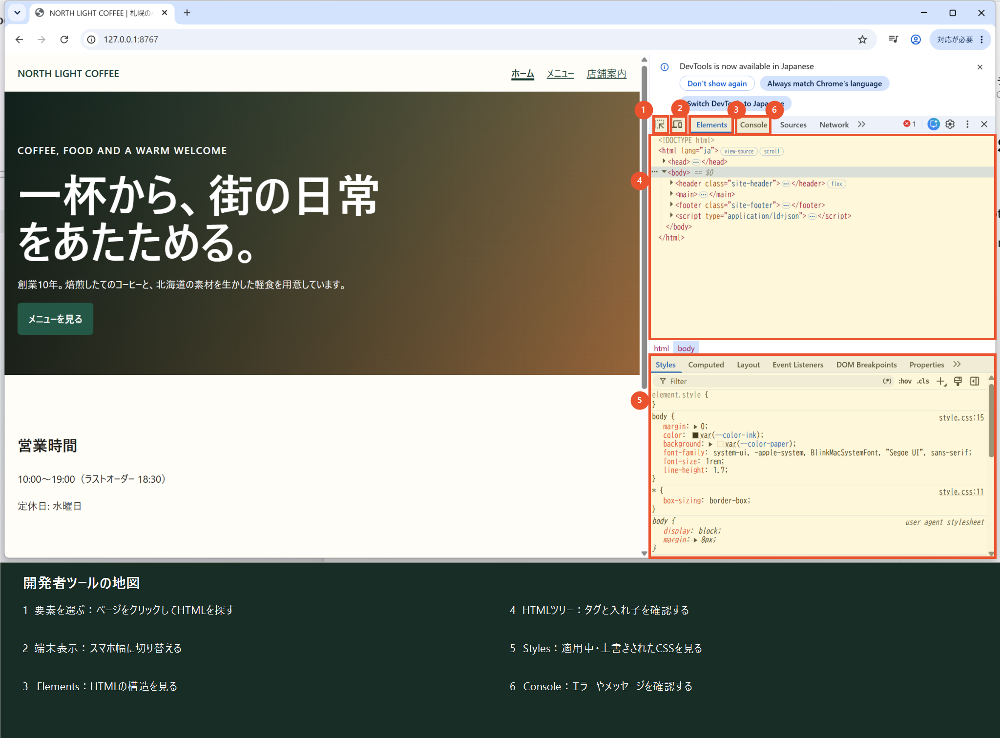

# はじめてのブラウザ開発者ツール

開発者ツールは、Webページの「中身」と「見た目」をブラウザ上で調べる虫めがねです。ここで試した変更は元のHTMLやCSSには保存されません。安心して試し、最後に再読み込みして元へ戻ることを確かめましょう。

## 今日のゴール

- ページ上の文字が、どのHTML要素か見つけられる
- 適用中のCSSと、取り消されているCSSを見分けられる
- パソコンとスマートフォン幅を切り替えられる
- Consoleにエラーがあるか確認できる
- 開発者ツールの変更は一時的だと説明できる

## まずは画面の地図を見よう

開発者ツールの見た目は、Chromeのバージョンや画面の広さによって少し変わります。まったく同じ場所になくても、アイコンやタブの名前を手がかりに探してみましょう。

## 1. 開いてみよう

`starter-site/index.html`をローカルHTTPサーバーで表示してから、次のどれかで開きます。

- Windows／Linux: `F12`または`Ctrl + Shift + I`
- macOS: `Command + Option + I`
- 調べたい場所を右クリックして「検証」

画面の右側や下側にパネルが出れば成功です。配置が違っても、同じ名前のタブを探せば大丈夫です。

## 2. ElementsでHTMLを見つけよう

1. 左上にある「ページ上の要素を選ぶ」矢印アイコンを押す。
2. カフェサイトの見出しへマウスを動かす。
3. 見出しをクリックし、Elementsで`h1`が選ばれるか確認する。
4. Elements内の見出し文字をダブルクリックし、一時的に別の文章へ変える。
5. ページを再読み込みし、元の文章へ戻ることを確認する。

> 問いかけ: 画面では変わったのに、VS CodeのHTMLが変わっていないのはなぜでしょう？

## 3. StylesでCSSを試そう

1. `h1`を選んだまま、Stylesを開く。
2. `color`や`font-size`を探す。
3. プロパティ左側のチェックを外し、見た目の変化を確認する。
4. 値を一時的に変え、どのCSSが見た目を作っているか確かめる。
5. 取り消し線が付いた指定があれば、「別の指定に上書きされたCSS」だと確認する。

開発者ツールで良い値を見つけても、それだけでは納品できません。採用する変更はVS CodeのCSSへ書き、保存してからブラウザで再確認します。

## 4. スマートフォン幅で見よう

1. 開発者ツール左上の端末アイコンを押す。ショートカットは`Ctrl + Shift + M`です。
2. 幅を`375`px程度にする。
3. 横スクロール、文字切れ、押しにくいボタンがないか見る。
4. 端末表示を終了し、パソコン幅へ戻す。

端末名を選ぶだけで完成ではありません。幅を少しずつ変え、内容が崩れる場所を探しましょう。

## 5. Consoleでエラーを見よう

1. Consoleを開く。
2. 赤いエラーがないか確認する。
3. エラーがあれば、最初の1件について「ファイル名」「行番号」「メッセージ」をメモする。

Consoleは命令も実行できる場所です。授業では、意味の分からないコードを貼り付けません。WebサイトやAIから「これをConsoleへ貼って」と言われても、講師へ確認してからにしましょう。

## 15分ミッション

| 時間 | やること | 残す証拠 |
|---:|---|---|
| 3分 | 開発者ツールを開き、`h1`を選ぶ | 選んだタグ名 |
| 4分 | 見出し文字とCSSを一時変更する | 変更中の画面 |
| 3分 | 再読み込みで元へ戻す | 「元へ戻った」のメモ |
| 3分 | 375px幅で表示する | 気づいたこと1つ |
| 2分 | Consoleを確認する | エラーの有無 |

## 安全チェック

- □ 開発者ツールの変更と、ファイルの変更を区別できた
- □ パスワード、Cookie、秘密のキーを画面共有や提出物へ写していない
- □ Consoleへ意味の分からないコードを貼っていない
- □ 本番サイトではなく、授業用サイトで試した
- □ 最後に再読み込みし、元へ戻ることを確認した
