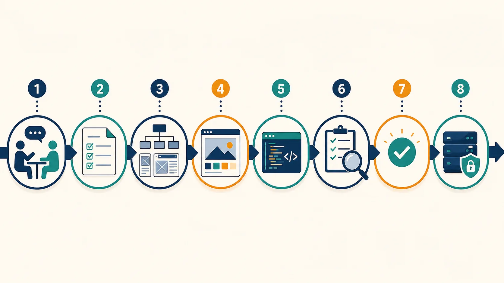

# AIに正しく指示するためのWeb制作・EC業務用語集

## この用語集の目的

AIは、曖昧な依頼にもそれらしい回答を返します。しかし「いい感じのページを作って」だけでは、目的、対象、成果物、品質、変更範囲が決まりません。業務用語を使う目的は難しく話すことではなく、AIと人へ同じ作業範囲を伝えることです。

各用語は次の3点で覚えます。

- **意味:** 現場で何を指すか
- **AIへの指示例:** 作業へ変換できる表現
- **注意:** 混同や事故を防ぐポイント

---

## 図1 Web制作の業務工程



1. ヒアリング
2. 要件定義
3. 情報設計・ワイヤーフレーム
4. ビジュアルデザイン
5. コーディング
6. 品質保証
7. 承認
8. 公開・運用

AIへ依頼するときは、今どの工程にいて、どの工程まで依頼するかを最初に示します。

> 例: 「現在は3のワイヤーフレーム工程です。デザインやコーディングは行わず、ページの情報優先順位だけを提案してください」

## 1. 受注・ディレクション

| 用語 | 意味 | AIへの指示例・注意 |
|---|---|---|
| クライアント | 制作を依頼し、事業上の判断をする顧客 | 「クライアント確認が必要な未確定事項を抽出して」。AIを承認者にしない |
| ステークホルダー | 制作物の影響を受ける関係者 | 「店舗、広報、採用担当ごとの関心事項を整理して」 |
| ヒアリング | 目的、背景、制約、不明点を聞き取る工程 | 「新規サイト用の質問を、目的・利用者・内容・機能・運用に分類して」 |
| 要件 | 成果物が満たすべき条件 | 「要望を、検証可能な要件へ書き換えて」 |
| 要件定義 | 目的、範囲、機能、品質、制約、承認条件を合意すること | 「要件定義書の不足項目を指摘して。推測で補完しないで」 |
| スコープ | 今回の作業に含む範囲 | 「対象ページは3ページ。ロゴ変更と文章執筆はスコープ外」 |
| スコープ外 | 契約・作業対象に含まないもの | AIへ「実装しない項目」として明記する |
| 前提条件 | 計画や判断の土台となる条件 | 「原稿は支給済み、サーバー契約済みを前提に見積もって」 |
| 制約条件 | 技術、予算、期限、規約などの制限 | 「JavaScriptなし、90分、既存CSSを維持」 |
| 成果物 | 納品・確認する具体物 | 「成果物はサイトマップ、ワイヤー3画面、質問一覧」 |
| 受入基準 | 完了と判断する検証可能な条件 | 「320pxで横スクロールなし」など、見た目の感想にしない |
| KPI | 目的の達成度を見る主要指標 | 「問い合わせ増加に対する先行KPIを提案して」 |
| ペルソナ | 設計検討用に具体化した代表利用者像 | 実データなしで架空人物を事実扱いしない |
| ターゲット | 主に届けたい利用者の範囲 | 年齢だけでなく課題、状況、知識も指定する |
| カスタマージャーニー | 利用者が認知から行動へ進む過程 | 「検索から予約完了までの不安と必要情報を整理して」 |
| WBS | 作業を実行可能な単位へ分解した一覧 | 「依存関係、担当、所要時間、完了条件を含むWBSにして」 |
| マイルストーン | 重要な中間到達点 | 初稿、承認、入稿完了、公開など |
| クリティカルパス | 遅れると全体納期へ直結する作業列 | 「素材撮影が3日遅れた場合の影響を示して」 |
| リスク | 発生が不確実で、影響を与える事象 | 問題発生後の「課題」と区別する |
| 課題 | すでに発生して対応が必要な問題 | 「担当、期限、次の行動を付けて課題表にして」 |
| 変更要求 | 合意後に追加・変更された依頼 | 「納期、費用、品質への影響を評価してから反映案を出して」 |
| 議事録 | 決定、未決、担当、期限を残す記録 | 会話の全文ではなく、行動可能な記録にする |
| エスカレーション | 自分の権限で解決できない問題を上位者へ上げること | 「公開遅延リスクとして、いつ誰へ報告すべきか整理して」 |

## 2. 情報設計・UX・デザイン

| 用語 | 意味 | AIへの指示例・注意 |
|---|---|---|
| IA（情報アーキテクチャ） | 情報を見つけ、理解しやすく組織する設計 | 「内容を利用者の目的別に分類して」 |
| コンテンツ棚卸し | 現行ページ、文章、画像、状態、移行判断の一覧化 | 「URL、所有者、更新日、継続・修正・削除で表にして」 |
| サイトマップ | サイト内ページの階層・関係図 | XMLサイトマップと区別して指示する |
| ユーザーフロー | 利用者が目的達成まで進む画面・操作の流れ | 「入口、判断、入力、確認、完了、エラーを含めて」 |
| 導線 | 利用者を次の情報・行動へ導く経路 | 見た目の矢印だけでなく、リンク文言と配置を含む |
| ワイヤーフレーム | 情報順、領域、機能を確認する低忠実度設計 | 「色や写真を決めず、スマホ幅の情報優先順位を作って」 |
| モックアップ | 完成時の見た目に近い静的デザイン | 動作確認用のプロトタイプと区別する |
| プロトタイプ | 画面遷移や操作を試せる試作品 | 「予約フローだけ操作可能にして検証項目を添えて」 |
| ファーストビュー | 読み込み直後、スクロール前に見える領域 | 端末や画面高で範囲が変わる |
| CTA | 利用者へ求める主要行動とその導線 | 「問い合わせる」「購入する」など動詞で定義する |
| UI | 画面上の表示・操作の接点 | ボタン、入力欄、ナビゲーションなど |
| UX | 利用前後を含む体験全体 | UIの美しさだけをUXと呼ばない |
| ユーザビリティ | 目的を効果的・効率的・満足して達成できる度合い | 「初見の利用者が迷う箇所をタスク別に評価して」 |
| アクセシビリティ | 障害や利用環境にかかわらず情報・操作を利用できること | 「キーボード、拡大、見出し、代替テキストを手動確認して」 |
| デザインシステム | 一貫した設計原則、部品、ルール、資産の体系 | 単なる部品一覧より広い |
| デザイントークン | 色、文字、余白等を名前付きの値として管理する仕組み | 「primary-500の用途と禁止用途を定義して」 |
| コンポーネント | 再利用できるUI部品 | ボタン、カード、ヘッダーなど |
| バリアント | 同一部品の種類・状態の違い | サイズ、重要度、状態を組み合わせる |
| ブレークポイント | レイアウトを切り替える境界 | 特定端末ではなく内容が破綻する幅で決める |
| レスポンシブ | 画面・入力方法等へ適応する設計 | PC版とスマホ版の2枚だけを指さない |
| コントラスト | 前景と背景の明暗・色の差 | ブランドカラーより読みやすさを優先する場面を明記 |
| ホワイトスペース | 情報を分け、優先度を示す余白 | 「空いている無駄」ではない |

## 図2 Webサイトを構成する5層


1. **UI・表示:** 利用者が見る画面
2. **コンポーネント:** 再利用するデザイン部品
3. **フロントエンド:** HTML、CSS、JavaScript
4. **コンテンツ・CMS:** 文章、画像、商品、投稿、データ
5. **インフラ:** サーバー、ネットワーク、セキュリティ、バックアップ

> 例: 「変更対象は4のCMS内の商品説明です。3のテンプレートと5のサーバー設定は変更しないでください」

## 3. HTML・CSS・フロントエンド

| 用語 | 意味 | AIへの指示例・注意 |
|---|---|---|
| セマンティックHTML | 内容の意味に合うHTML要素を使うこと | 「見た目ではなく文書構造を基準に要素を選んで」 |
| DOM | ブラウザが文書を木構造として扱うモデル | JavaScriptの操作対象やアクセシビリティへ影響する |
| 属性 | HTML要素へ追加する情報 | `href`、`alt`、`lang`、`aria-*`など |
| 見出し階層 | `h1`〜`h6`による内容構造 | 文字サイズ目的で飛ばさない |
| 代替テキスト | 画像の情報・機能を文脈に合わせて言語化したもの | 装飾画像は空の`alt`になる場合がある |
| CSSセレクタ | スタイルを適用する対象の指定 | 「既存詳細度を上げず、クラスで限定して」 |
| カスケード | 複数のCSS宣言から適用値を決める仕組み | `!important`で隠さず原因を調べる |
| 詳細度 | 競合するCSSセレクタの優先度 | 「詳細度を計算し、最小変更を提案して」 |
| ボックスモデル | 内容、padding、border、marginによる領域 | サイズずれの調査に使う |
| Flexbox | 一方向の並び・整列に向くCSSレイアウト | ナビ、横並び、中央配置など |
| Grid | 行と列の二次元配置に向くCSSレイアウト | 商品一覧、ページ全体の領域など |
| モバイルファースト | 小さい画面の基本から必要時に拡張する設計 | モバイルだけ優先する意味ではない |
| ビューポート | ブラウザでページが表示される領域 | CSSピクセルと端末解像度を混同しない |
| JavaScript | 動的な操作・状態・通信を扱う言語 | HTML/CSSだけで満たせる要求に不要なJSを足さない |
| イベント | クリック、入力、送信等の発生を通知する仕組み | キーボード・タッチも考慮する |
| バリデーション | 入力やコードが条件を満たすか検証すること | フォーム検証とHTML構文検証を区別する |
| コンソール | ブラウザの実行ログ・エラー確認画面 | 「最初のエラーから原因を調べて」 |
| Core Web Vitals | 読み込み、応答性、視覚的安定性の主要指標 | 数値だけでなく利用体験と原因を見る |
| LCP | 主要コンテンツの表示速度指標 | ヒーロー画像、フォント、サーバー応答を候補にする |
| CLS | 読み込み中の意図しないレイアウト移動指標 | 画像寸法や後挿入要素を確認する |

## 4. CMS・WordPress

| 用語 | 意味 | AIへの指示例・注意 |
|---|---|---|
| CMS | 構造化したコンテンツを管理・公開する仕組み | 「更新者、頻度、権限からCMS要件を作って」 |
| コンテンツモデル | コンテンツの種類、項目、関係、制約の設計 | ニュース、商品、店舗を別々に定義する |
| 固定ページ | 階層的で比較的固定したWordPressコンテンツ | 会社概要、問い合わせなど |
| 投稿 | 時系列・分類で管理しやすいWordPressコンテンツ | ニュース、ブログなど |
| カスタム投稿タイプ | 案件固有のコンテンツ種類 | 乱用せず、更新業務から必要性を説明する |
| タクソノミー | 投稿等を分類する仕組み | カテゴリ、タグ、独自分類 |
| テーマ | コンテンツの表示・デザインを担う仕組み | プラグインの機能責任と分ける |
| ブロックテーマ | ブロックとSite Editorを中心に構成するテーマ | `theme.json`、テンプレート、パターンを含む |
| クラシックテーマ | PHPテンプレートを中心に構成する従来型テーマ | HTML、CSS、PHP、WordPress関数が必要 |
| テンプレート階層 | 表示対象に応じて使用テンプレートを決める規則 | 「投稿詳細にどのファイルが使われるか説明して」 |
| プラグイン | WordPressへ機能を追加する仕組み | 更新性、権限、代替、削除時影響を評価する |
| ショートコード | 投稿内などから機能を呼び出す記法 | 依存先停止時の表示を確認する |
| ステージング | 本番公開前に確認する分離環境 | 本番データの個人情報を無条件コピーしない |
| マイグレーション | サイト・データ・設定を別環境へ移すこと | DB、アップロード、URL、設定、認証を範囲化する |
| バックアップ | 復元に必要なデータを保存すること | 取得しただけでなく復元テストまで指示する |

## 図3 ECの商品・運用サイクル


1. 商品資料・撮影・事実確認
2. 商品マスター・SKU・画像管理
3. 商品ページ・カテゴリ・検索
4. カート・購入手続き
5. 決済・在庫・配送・顧客対応
6. 計測・分析・改善

> 例: 「3の商品ページだけでなく、2の商品マスターと5の在庫・配送への影響も確認してください」

## 5. EC・商品ページ

| 用語 | 意味 | AIへの指示例・注意 |
|---|---|---|
| EC | 電子的に商品・サービスを販売する仕組み | モール型と自社ECで制約が異なる |
| モール | 楽天市場等、複数店舗が入る販売基盤 | 媒体ごとの規約・審査・HTML制限を確認する |
| 自社EC | 企業が主体となって運営するECサイト | 集客、保守、セキュリティの責任範囲が広い |
| 商品マスター | 商品情報を一元管理する基礎データ | 「必須列、形式、文字数、出典、更新者を定義して」 |
| SKU | 在庫を区別して管理する最小単位 | 商品と色・サイズ等のSKUを混同しない |
| バリエーション | 色、サイズ、容量等の商品選択肢 | SKU、価格、在庫、画像との関係を定義する |
| カテゴリ | 商品を探しやすく分類する構造 | 社内都合だけでなく利用者の探し方を反映する |
| コレクション | 条件や手動選択でまとめた商品群 | プラットフォーム固有の意味も確認する |
| 商品詳細ページ | 一商品の情報と購入操作を提供するページ | 仕様、根拠、注意、配送、返品も含む |
| 商品画像 | 商品判断へ必要な視覚情報 | メイン、角度、寸法、利用例、注意等の役割を分ける |
| バナー | キャンペーン・カテゴリ等へ誘導する画像 | 目的、掲載面、サイズ、期限、CTAを指定する |
| カート | 購入候補と数量を保持する仕組み | 在庫、価格、送料、クーポンとの関係を確認する |
| チェックアウト | 配送先、決済等を入力し注文確定する工程 | 離脱、エラー、二重送信、完了通知を確認する |
| 決済 | 支払いを処理する仕組み | 実カード情報をテストに使わない |
| 在庫 | 販売可能数とその状態 | 予約、取り寄せ、欠品、複数倉庫を区別する |
| フルフィルメント | 受注後の保管、梱包、発送等の履行業務 | 画面だけでなく運用担当との接続を設計する |
| CVR | 訪問・閲覧等から購入へ至った割合 | 分母を明記する |
| カート放棄 | カート投入後に購入完了しないこと | 原因を断定せず計測・調査する |
| アップセル | より上位の商品を提案すること | 不必要な誘導や誤認を避ける |
| クロスセル | 関連商品を組み合わせて提案すること | 利用目的に関連する根拠を持たせる |

## 6. SEO・計測・改善

| 用語 | 意味 | AIへの指示例・注意 |
|---|---|---|
| SEO | 検索者と検索エンジンが内容を理解しやすくする改善 | 順位保証の手段として指示しない |
| 検索意図 | 検索者が達成したい目的 | 情報収集、比較、購入、訪問など |
| title要素 | ページを識別するHTML上の題名 | ページ固有で内容に一致させる |
| meta description | 検索結果説明の候補となる要約 | 必ず表示される広告文ではない |
| インデックス | 検索エンジンがページ情報を登録すること | クロールと区別する |
| クロール | 検索エンジンがURLを発見・取得すること | `robots.txt`と`noindex`を混同しない |
| canonical | 重複候補の代表URLを示す仕組み | リダイレクトの代わりではない |
| 301リダイレクト | URLの恒久移転を伝える転送 | リニューアル時は旧→新の対応表を作る |
| XMLサイトマップ | 検索エンジンへURLを伝えるファイル | 人向けのサイトマップと区別する |
| 構造化データ | 内容の種類・属性を機械へ明示するデータ | 画面表示と事実を一致させる |
| Search Console | Google検索での発見・登録・問題を確認するサービス | 公開前だけでなく公開後監視も計画する |
| アナリティクス | 利用状況を計測・分析する仕組み | 個人情報、同意、保持期間を確認する |
| コンバージョン | 事業上の目標行動 | 購入、問い合わせ、予約等を明確にする |
| ファネル | 行動段階と人数の減少を表す考え方 | 認知、閲覧、比較、行動など |
| 改善仮説 | 観察事実から立てる検証可能な予測 | 「問題、根拠、変更、期待指標、判定期間」で書く |
| A/Bテスト | 複数案を条件管理して比較する実験 | 同時に多くを変えず、母数と期間を考慮する |

## 7. 品質・公開・運用

| 用語 | 意味 | AIへの指示例・注意 |
|---|---|---|
| QA | 要求された品質を満たすための活動全体 | 最後の動作確認だけではない |
| テストケース | 条件、操作、期待結果を一組にした確認項目 | 「正常、エラー、境界、権限別で作って」 |
| 回帰テスト | 変更で既存機能が壊れていないかの再確認 | 影響範囲に合わせて選ぶ |
| クロスブラウザ | 複数ブラウザでの互換性確認 | 対象ブラウザとバージョン方針を定義する |
| デバイス検証 | 実機や画面条件で表示・操作を確かめること | 開発者ツールだけで完了にしない場合を決める |
| 不具合 | 期待結果と実際の結果の差 | 再現手順、環境、期待、実際、証拠を記録する |
| 重大度 | 不具合が利用者・事業へ与える影響 | 修正順を示す優先度と区別する |
| デプロイ | 変更物を利用可能な環境へ配置すること | 公開・リリースと同義でない場合がある |
| リリース | 変更を利用者へ提供開始すること | 配置済みでも非公開なら未リリースの場合がある |
| SFTP | SSHを利用した安全なファイル転送 | 接続先・リモートパス・対象を照合する |
| SSH | 暗号化された遠隔操作の仕組み | コマンド誤操作の影響範囲を限定する |
| DNS | ドメイン名を接続先へ対応づける仕組み | 変更反映に時間差がある |
| SSL/TLS | 通信を暗号化し、接続先を確認する仕組み | 証明書期限とHTTP→HTTPSを確認する |
| 本番環境 | 実際の利用者が使う環境 | 直接編集を避け、承認と復元を用意する |
| ロールバック | 問題時に以前の状態へ戻すこと | 「戻せるはず」ではなく手順と判断者を決める |
| 運用保守 | 公開後の更新、監視、障害、セキュリティ対応 | 更新頻度、担当、窓口、対応時間を定義する |
| SLA | 提供品質や応答時間等の合意 | 「24時間以内の一次返信」と「解決時間」を区別する |

## 8. AIへ指示するときの用語

| 用語 | 意味 | AIへの指示例・注意 |
|---|---|---|
| プロンプト | AIへ渡す指示・文脈・入力 | 目的、対象、材料、制約、出力、検証を含める |
| コンテキスト | 判断に必要な背景情報 | 不要な個人情報や秘密を含めない |
| 役割 | AIに求める視点・専門性 | 権限や実務経験を持つと誤認しない |
| 制約 | 行ってはいけないこと、守る条件 | 「対象外ファイルを変更しない」など |
| 出力形式 | 表、Markdown、JSON、コード等の形 | 項目名、順序、長さまで指定する |
| 根拠 | 判断を支える事実・資料 | 「不明は不明とし、推測を分離して」 |
| 一次情報 | 当事者・公式組織が直接示す情報 | 現行仕様は公式資料で確認させる |
| ハルシネーション | AIが事実でない内容をもっともらしく生成すること | 実在URL、法令、価格、仕様を検証する |
| ガードレール | 危険・逸脱を防ぐルールや確認地点 | 「公開、送信、削除の前に停止して確認」 |
| 人間によるレビュー | AI出力を責任ある人が確認すること | AIの自己評価だけで完了にしない |
| イテレーション | 小さく作り、確認し、改善する反復 | 一度に全面変更せず、一件ずつ直す |
| 受入テスト | 出力が要求を満たすか利用者側で確認すること | AIへ基準を作らせ、人が実行・判断する |

## AI指示の基本テンプレート

```text
目的:
利用者・対象:
現在の工程:
入力資料と信頼できる根拠:
依頼する作業:
成果物:
スコープ:
スコープ外:
制約:
受入基準:
不明点の扱い:
人間の確認が必要な地点:
```

### 悪い指示

> カフェのサイトをいい感じにリニューアルして。

### 業務用語を使った指示

> 目的は新規客の来店予約増加です。現在は要件定義工程で、実装はスコープ外です。  
> 20〜30代のスマートフォン利用者を主対象に、現行3ページのコンテンツ棚卸し、サイトマップ、予約までのユーザーフロー、未確定事項を作成してください。  
> 支給資料にない営業時間や料金は推測しないでください。成果物はMarkdownの表とMermaid図にし、クライアント確認事項を最後にまとめてください。

## 授業での使い方

1. 依頼メールから分からない用語を3つ選ぶ
2. 用語を使わない曖昧なAI指示を書く
3. この用語集から必要な言葉を選び、指示を書き直す
4. 2つの出力を、スコープ、根拠、受入基準で比較する
5. AIが推測した箇所を探し、人間への確認事項へ変える

