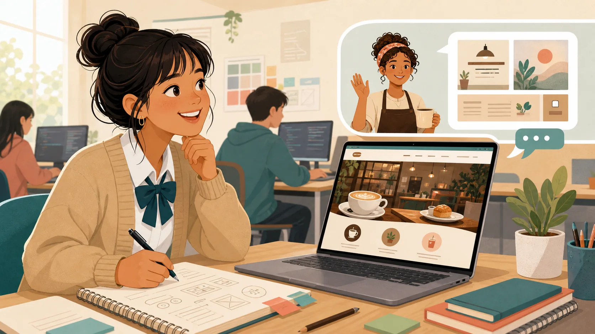
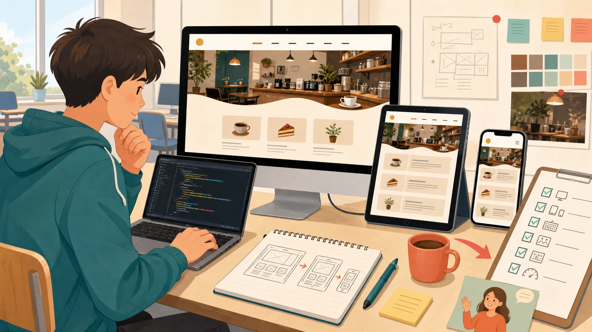
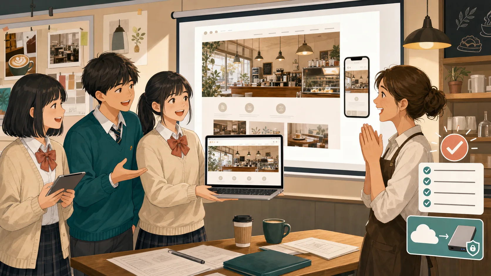

# 新人Webデザイナー お仕事ワークブック

今日からあなたは、架空のカフェ **「NORTH LIGHT COFFEE」** を担当する新人Webデザイナーです。

このワークブックでは、毎回お客さまから届く依頼を読み、必要なHTML・CSSを学びながら、実際のWeb制作に近い流れで仕事を進めます。

大切なのは、**きれいなページを作ることだけではありません。**

- 依頼を正しく読む
- 分からないことを質問する
- 変更してよい場所と、してはいけない場所を分ける
- 小さく変更して確認する
- 作業内容を自分の言葉で報告する

ここまでできて、1つの仕事が完了です。

---

## このワークブックのゴール

15回の授業が終わるころには、次のことを一人で進められることを目指します。

1. Web制作の依頼内容を読み取れる
2. HTML・CSSを使って必要な修正ができる
3. パソコンとスマートフォンの両方で確認できる
4. 修正前と修正後の違いを説明できる
5. 分からないことを質問できる
6. GitHubに作業を残せる
7. 自分の制作物をポートフォリオとして紹介できる

---

## 毎回の授業の始め方

授業を始めるときは、毎回同じ順番で準備します。

### STEP 1　リポジトリを開く

CodespacesまたはVS Codeで、このリポジトリのルートを開きます。

左側のファイル一覧に、

- README.md
- hht

が見えていることを確認してください。

### STEP 2　自分の作業場所を確認する

ソース管理画面で、自分のブランチまたは自分用のコピーを使っていることを確認します。

他の人の作業場所をそのまま編集しないようにします。

### STEP 3　今日のDAYを開く

[学生向け授業入口](../student/README.md)から、今日のDAYを開きます。

### STEP 4　依頼を読む

すぐに作り始めず、最初に依頼文を読みます。

最低でも次の3つを確認します。

- 何を直してほしいのか
- どこまで直してよいのか
- 分からないことはないか

---

## 毎回のお仕事ルート

どのDAYでも、基本は同じ順番で進めます。

~~~text
1. 依頼を読む
      ↓
2. 作業前に確認する
      ↓
3. 今日必要な技を学ぶ
      ↓
4. 小さく変更する
      ↓
5. ブラウザで確認する
      ↓
6. 作業内容を報告する
~~~

迷ったときは、今どの段階にいるかを確認してください。

---

# DAY 1 はじめての依頼メール

> **佐藤さんからの依頼**  
> カフェのWebサイトを更新してほしいです。まずは受け取ったことを返信して、今のサイトを確認してください。

## 今日の目的

最初の仕事では、Webページを大きく作り変えることよりも、**安全に作業を始められる状態を作ること**が目的です。

「ファイルを開く」「ブラウザで見る」「変更する」「元に戻す」というWeb制作の基本を確認します。

## 今日のゴール

授業の最後に、次の状態になっていれば完了です。

- カフェサイトをブラウザで表示できる
- HTMLファイルがどこにあるか分かる
- 開発者ツールで見出しを確認できる
- 一度変更して、元の状態に戻せる
- 練習用URLを開ける
- 依頼を受け取ったことを3文程度で報告できる

## STEP 1　依頼を読み取る

依頼文を読んだら、次をメモします。

- 依頼した人はだれか
- ToとCCにはだれがいるか
- 今回頼まれていることは何か
- まだ頼まれていないことは何か
- 分からないことはあるか

この時点では、まだファイルを変更しません。

## STEP 2　今のサイトを確認する

まず、変更前のサイトを見ます。

確認すること:

1. トップページを開く
2. 見出しを読む
3. 画像が表示されているか見る
4. リンクを1つ押してみる
5. スマートフォン幅でも見てみる

「最初はどうなっていたか」を覚えておくことが大切です。

## STEP 3　開発者ツールを触ってみる

[ブラウザ開発者ツール](./devtools-first-lesson.md)を開きます。

次の順番で試してください。

1. Elementsを開く
2. ページの見出しを選ぶ
3. 見出しの文字を一時的に変える
4. CSSを1つ一時的に変える
5. ページを再読み込みする
6. 元に戻ったことを確認する
7. 画面幅を375pxにして見る
8. Consoleに赤いエラーがないか見る

ここでの変更は本物のファイルには保存されません。

**目的:** 「ブラウザに見えているもの」と「保存されているファイル」は別だと理解することです。

## STEP 4　HTMLを少し変更する

講師の指示に従って、HTMLの文字を1か所だけ変更します。

変更したら必ず、

1. 保存する
2. ブラウザを再読み込みする
3. 変更した文字が表示されたか確認する

まで行います。

## STEP 5　変更前へ戻してみる

Web制作では、間違えたときに戻せることが重要です。

講師の指示に従って、

1. 現在の状態を保存する
2. 変更前の状態へ戻す
3. ブラウザで元に戻ったことを確認する
4. 必要であれば、もう一度変更後へ戻す

ところまで試します。

## STEP 6　公開先を確認する

練習用の公開URLを開きます。

ローカルだけでなく、公開先でも同じページが見えることを確認します。

## STEP 7　作業を報告する

次の3点を含めて返信文を作ります。

- 依頼を受け取ったこと
- 練習用URLを確認したこと
- まだ確認したいこと

### 返信例の形

~~~text
ご依頼を確認しました。
練習用URLで現在のサイトを確認できました。
○○について確認したいことがあります。
~~~

## 完了チェック

- [ ] ToとCCを確認した
- [ ] Elementsで見出しを選べた
- [ ] CSSを一時的に変更できた
- [ ] 375px幅で確認した
- [ ] Consoleを確認した
- [ ] HTMLを変更して表示できた
- [ ] 元の状態へ戻せた
- [ ] 公開URLを確認できた
- [ ] 返信文を書いた

---

# DAY 2 「創業10年」を直して

> **佐藤さんからの依頼**  
> 「創業10年」を「地域と歩んで12年」に変更してください。

## 今日の目的

文章を変更するときに、**同じ言葉を全部まとめて置き換えない**ことを学びます。

Web制作では、同じ言葉が別の意味で使われていることがあります。

## 今日のゴール

- 「創業10年」が使われている場所を全部見つける
- 変更する場所と、変更しない場所を分ける
- HTMLの基本タグを確認する
- 修正後の表示をブラウザで確認する
- どこを変更したか報告する

## STEP 1　依頼の対象を確認する

まず、依頼文の「創業10年」が、サイトのどの文章を指しているのか考えます。

「同じ文字だから全部変更する」と決めつけないでください。

## STEP 2　サイト全体を検索する

エディターの検索機能を使って「創業10年」を探します。

見つかった場所をメモします。

| 見つけた場所 | 変更する？ | 理由 |
|---|---|---|
| 例: トップページ | はい | 依頼の内容と一致 |
| | | |

## STEP 3　HTMLの意味を確認する

変更する場所の周りにあるHTMLを見ます。

今日確認する主なタグ:

- h1〜h3: 見出し
- p: 文章
- ul / ol / li: リスト
- a: リンク
- img: 画像
- alt: 画像の説明

「どのタグに入っている文字か」を確認してから変更します。

## STEP 4　対象だけを変更する

変更すると決めた場所だけを修正します。

一括置換は使わず、1か所ずつ確認しながら進めます。

## STEP 5　ブラウザで確認する

変更後に次を確認します。

- 依頼された文章になっている
- 見出しやレイアウトが崩れていない
- 変更しないと決めた場所はそのまま
- リンクや画像が壊れていない

## STEP 6　報告する

報告には、

- 変更したページ
- 変更した文章
- 似ていたが変更しなかった場所

を書きます。

## 完了チェック

- [ ] 検索で候補を全部見つけた
- [ ] 一括置換を使わなかった
- [ ] 変更する理由を説明できる
- [ ] 変更しない場所も確認した
- [ ] ブラウザで表示を確認した
- [ ] 作業内容を報告した

---

# DAY 3 ボタンのデザインをそろえて

> **佐藤さんからの依頼**  
> ページによって「メニューを見る」ボタンの色や形が違います。同じデザインにそろえられますか？

## 今日の目的

同じ役割のパーツに、同じCSSを使う考え方を学びます。

1か所ずつ別のCSSを書くのではなく、**共通の名前を付けて使い回す**ことがポイントです。

## 今日のゴール

- 同じ役割のボタンを探す
- classを使って共通の見た目にする
- CSSを別ファイルにまとめる
- 変更前後をブラウザで比較する

## STEP 1　対象のボタンを探す

3ページを開き、「メニューを見る」ボタンを探します。

現在の違いをメモします。

- 色
- 文字サイズ
- 角の丸さ
- 余白
- 横幅

## STEP 2　共通にする内容を決める

全部同じにするのか、一部だけ同じにするのかを考えます。

例:

- 色は同じ
- 角の丸さも同じ
- 横幅はページによって違ってよい

## STEP 3　classを付ける

何度も使うスタイルにはclassを使います。

idとの違いも確認します。

- id: 基本的に1か所だけ
- class: 同じ役割の複数要素に使える

## STEP 4　CSSを書く

共通のclassに対してCSSを書きます。

まず小さな変更から始めて、1つずつブラウザで確認します。

## STEP 5　3ページを比較する

すべての対象ページを開いて、ボタンの見た目がそろったか確認します。

## STEP 6　報告する

- どのページを変更したか
- 何を共通化したか
- まだ確認してほしい点

を書きます。

## 完了チェック

- [ ] 対象ボタンを全部確認した
- [ ] classを使った
- [ ] CSSを別ファイルに書いた
- [ ] 3ページをブラウザで比較した
- [ ] 文字が読みにくくなっていない
- [ ] 変更内容を報告した

---

# DAY 4 お店の情報が見つけにくい

> **佐藤さんからの相談**  
> 初めてサイトを見る人から、営業時間やアクセスが見つけにくいと言われました。

## 今日の目的

見た目を変える前に、**情報を分かりやすいまとまりに分ける**ことを学びます。

## 今日のゴール

- ページにどんな情報があるか整理する
- 大切な情報の順番を考える
- header、nav、main、section、footerなどを使い分ける
- 文章の内容を勝手に変更せず、構造を整理する

## STEP 1　今のページを読む

まずCSSを気にせず、ページに何が書いてあるかを確認します。

情報を紙やメモに書き出します。

例:

- 店名
- 営業時間
- アクセス
- お知らせ
- メニュー
- 問い合わせ

## STEP 2　情報をグループに分ける

似た役割の情報をまとめます。

「営業時間」と「アクセス」は店舗案内、「メニュー」は商品情報、というように考えます。

## STEP 3　ページの順番を考える

初めて見る人が知りたい順番を考えます。

文章そのものは変更せず、並び方だけを考えます。

## STEP 4　HTMLの構造を整える

今日使う主なタグ:

- header
- nav
- main
- section
- article
- aside
- footer

タグの名前ではなく、**その部分が何の役割を持つか**で選びます。

## STEP 5　見出しだけ読んで確認する

h1、h2、h3だけを上から読んで、ページの内容が想像できるか確認します。

## STEP 6　報告する

「文章は変えず、情報のまとまりと順番を整理した」と説明します。

## 完了チェック

- [ ] ページの情報を書き出した
- [ ] 情報を役割ごとに分けた
- [ ] mainが1つになっている
- [ ] h1の役割を説明できる
- [ ] 文章内容を勝手に変えていない
- [ ] 見出しだけでも内容が分かる

---

# DAY 5 全ページの上と下をそろえて

> **佐藤さんからの依頼**  
> どのページを見ても同じメニューから移動できるようにしてください。

## 今日の目的

複数ページで共通して使う部分をそろえ、利用者が迷わないサイトにします。

## 今日のゴール

- 対象ページを全部確認する
- ヘッダーとフッターをそろえる
- 今どのページにいるか分かるようにする
- Tabキーでもリンクを移動できるようにする

## STEP 1　対象ページを確認する

まず3ページを開きます。

それぞれの、

- メニュー名
- メニューの順番
- フッター
- リンク先

を比べます。

## STEP 2　共通ルールを決める

どのページでも同じにするものを決めます。

例:

- メニューの順番
- サイト名
- フッターの情報
- 余白

## STEP 3　HTMLをそろえる

3ページのheader、nav、footerを同じ考え方でそろえます。

## STEP 4　CSSを整える

今日使う主な内容:

- margin / padding
- max-width
- display: flex
- gap
- focus-visible

1つずつ追加して確認します。

## STEP 5　キーボードで確認する

マウスを使わずTabキーだけでリンクを移動します。

今どこにいるか見えることを確認します。

## STEP 6　3ページすべてを見る

1ページだけで完成にしません。

3ページを行き来して確認します。

## 完了チェック

- [ ] 3ページを確認した
- [ ] メニュー名と順番がそろっている
- [ ] リンク先が正しい
- [ ] 現在ページが分かる
- [ ] Tabキーで移動できる
- [ ] 文字が切れたり重なったりしていない

---

# DAY 6 人気メニューを見つけやすくして

> **佐藤さんからの依頼**  
> 人気メニューを写真付きで見やすく並べたいです。説明が長い商品もあります。

## 今日の目的

内容の長さが違っても崩れにくい「商品カード」を作ります。

## 今日のゴール

- 商品1件分のカードを作る
- 複数カードを並べる
- 長い商品名や説明でも崩れない
- スマートフォンでは読みやすく1列にする

## STEP 1　カードに必要な情報を決める

商品カード1枚に必要な内容を整理します。

例:

- 商品画像
- 商品名
- 説明
- 価格

## STEP 2　まず1枚作る

いきなり4枚並べず、最初は1枚だけ作ります。

HTMLの構造とCSSを確認します。

## STEP 3　4枚に増やす

1枚が完成したら、商品を4件に増やします。

## STEP 4　長い文章で試す

短い文章だけではなく、

- 長い商品名
- 長い説明
- 価格の桁数が違うもの

でも確認します。

## STEP 5　並べ方を選ぶ

FlexboxとGridのどちらが今回向いているか考えます。

「何となく」ではなく、理由を一言で説明できるようにします。

## STEP 6　スマートフォンで確認する

スマートフォン幅では、商品カードが読みやすい順番で1列になるか確認します。

## 完了チェック

- [ ] 商品カードを1枚から作った
- [ ] 複数の商品を並べた
- [ ] 長い商品名で試した
- [ ] 説明が長くても重ならない
- [ ] 価格が見やすい
- [ ] スマートフォンで読みやすい
- [ ] FlexboxまたはGridを選んだ理由を説明できる

---

# DAY 7 お問い合わせフォームがほしい

> **佐藤さんからの依頼**  
> 名前、メール、問い合わせ内容を入力できるフォームを作ってください。まだ実際の送信はしません。

## 今日の目的

見た目だけではなく、**迷わず入力できるフォーム**を作ります。

今回は実際の送信処理は作りません。

## 今日のゴール

- 名前・メール・問い合わせ内容を入力できる
- すべての入力欄に説明がある
- キーボードだけでも操作できる
- 必須項目が分かる
- 本物の個人情報を使わずテストする

## STEP 1　必要な項目を整理する

依頼文から必要な項目を抜き出します。

今回必要なのは、

- 名前
- メール
- 問い合わせ内容

です。

頼まれていない個人情報を勝手に増やさないようにします。

## STEP 2　HTMLを作る

今日使う主なタグ:

- form
- label
- input
- textarea
- button

必要に応じて、

- checkbox
- radio
- fieldset
- legend
- select

も確認します。

## STEP 3　labelを確認する

すべての入力欄に「何を入力する場所か」が分かるlabelを付けます。

labelの文字をクリックして入力欄を選べるか確認します。

## STEP 4　必須項目を分かりやすくする

色だけで「必須」を表さず、文字でも分かるようにします。

## STEP 5　架空の情報で入力する

本物の氏名やメールアドレスは使わず、架空のデータで試します。

## STEP 6　Tabキーで操作する

マウスを使わず、Tabキーだけで、

- 名前
- メール
- 問い合わせ内容
- ボタン

まで移動できるか確認します。

## 完了チェック

- [ ] 必要な項目だけを作った
- [ ] すべての入力欄にlabelがある
- [ ] 必須項目が文字でも分かる
- [ ] 架空の情報で試した
- [ ] Tabキーだけで操作できる
- [ ] 今回は実送信しないことを理解している

---

# DAY 8 営業時間を見逃さないようにして

> **佐藤さんからの相談**  
> 店舗案内を読んでいると、営業時間がどこにあったか分からなくなります。

## 今日の目的

大切な情報を見つけやすくします。

「固定表示にすればよい」と決めつけず、**利用者にとって邪魔にならない方法を比較する**ことがポイントです。

## 今日のゴール

- 営業時間が現在どこにあるか確認する
- 固定しない案も考える
- 必要ならstickyなどを使う
- スマートフォンでも邪魔にならないようにする

## STEP 1　現在の問題を確認する

実際にページをスクロールして、「どの場面で見失うか」を確認します。

## STEP 2　固定しない方法を考える

最初に、

- 見出しを分かりやすくする
- ページ上部にも営業時間を置く
- 情報の順番を変える

などで解決できないか考えます。

## STEP 3　固定表示を試す

必要ならposition、sticky、fixedを試します。

## STEP 4　邪魔になっていないか確認する

次を確認します。

- 本文を隠していない
- リンクを隠していない
- フォームを隠していない
- スマートフォンでも大きすぎない

## STEP 5　採用理由を書く

採用した案と、採用しなかった案を1つずつ書きます。

## 完了チェック

- [ ] 現在の問題を確認した
- [ ] 固定しない案も考えた
- [ ] 採用理由を説明できる
- [ ] 本文やリンクを隠していない
- [ ] スマートフォンで確認した
- [ ] 拡大表示でも使える

---

# DAY 9 もっとインパクトのある写真に

> **佐藤さんからの依頼**  
> 最初に出る写真を、もっとインパクトのあるものにしてください。

## 今日の目的

「インパクト」というあいまいな依頼を、そのまま作業せず、**質問して具体的にする**ことを学びます。

## 今日のゴール

- 何を目立たせたいのか確認する
- 使用できる画像か確認する
- PCとスマートフォンで切れ方を見る
- 文字が読める状態にする
- 選んだ理由を説明する

## STEP 1　質問を考える

依頼者に確認したいことを考えます。

例:

- コーヒーを目立たせたいですか
- お店の雰囲気を目立たせたいですか
- 写真の上に文字を置きますか
- 避けたい表現はありますか

## STEP 2　候補画像を比べる

複数案を比べます。

確認すること:

- 利用してよい画像か
- 不自然な部分はないか
- 写真の主役が分かるか
- 文字を重ねても読めるか

## STEP 3　Web向けに調整する

必要に応じて、

- トリミング
- object-fit
- WebP / AVIF
- 背景の暗さ

などを調整します。

## STEP 4　PCとスマートフォンで見る

同じ写真でも画面幅によって切れ方が変わります。

大切な部分が見切れていないか確認します。

## STEP 5　選んだ理由を報告する

「こちらの方がインパクトがあります」だけではなく、

- 何が見やすいのか
- 何を目立たせたのか
- スマホでどう見えるのか

まで説明します。

## 完了チェック

- [ ] あいまいな点を質問した
- [ ] 画像の利用条件を確認した
- [ ] 候補を比較した
- [ ] PCで確認した
- [ ] スマートフォンで確認した
- [ ] 文字が読みやすい
- [ ] 選んだ理由を説明できる

---

# DAY 10 スマホでボタンが押しにくい

> **佐藤さんからの連絡**  
> スマートフォンで見ると、メニューが横にはみ出し、ボタンも押しにくいそうです。

## 今日の目的

小さな画面でも使いやすいページにします。

「PC版を小さくする」のではなく、**小さい画面から考える**ことを意識します。

## 今日のゴール

- 修正前の問題を確認する
- 横スクロールをなくす
- ボタンを押しやすくする
- 320px・768px・1280pxで確認する

## STEP 1　問題を再現する

修正する前に、320px程度の画面幅でページを見ます。

問題をメモします。

例:

- メニューが右にはみ出す
- ボタンが小さい
- 文字が切れる
- 画像が大きすぎる

## STEP 2　1つずつ直す

一度に全部変更せず、1つ直したら確認します。

## STEP 3　必要なCSSを使う

今日使う主な内容:

- viewport
- %
- rem
- clamp()
- media query
- max-width

## STEP 4　3つの画面幅で確認する

同じ場所を、

- 320px
- 768px
- 1280px

で確認します。

## STEP 5　修正内容を報告する

「レスポンシブ対応しました」だけではなく、どの幅で何を直したかを書きます。

## 完了チェック

- [ ] 修正前の問題を確認した
- [ ] 320pxで横スクロールがない
- [ ] ボタンが押しやすい
- [ ] 文字が切れていない
- [ ] 画像がはみ出していない
- [ ] 768pxで確認した
- [ ] 1280pxで確認した

---

# DAY 11 5つの更新依頼を安全に直して

> **佐藤さんからの依頼**  
> 添付文章、開店時刻、ラストオーダー、アイスカフェラテの価格、フッターの年を更新してください。

## 今日の目的

複数の依頼を混ぜずに、**1件ずつ確認しながら安全に修正する**ことを学びます。

## 今日のゴール

5つの依頼をそれぞれ分けて管理し、依頼された場所だけを変更します。

## STEP 1　5つの依頼を分けて書く

最初に次の表を作ります。

| No. | 依頼 | 対象 | 確認が必要？ | 完了 |
|---:|---|---|---|---|
| 1 | 添付文章 | | | |
| 2 | 開店時刻 | | | |
| 3 | ラストオーダー | | | |
| 4 | アイスカフェラテ価格 | | | |
| 5 | フッターの年 | | | |

## STEP 2　不明点を先に確認する

分からないまま変更しないようにします。

例:

- 開店時刻はどの店舗か
- ラストオーダーは何分前か
- 価格はどのサイズか
- フッターの年は何を表しているか

## STEP 3　1件ずつ変更する

No.1を変更して確認したらNo.2へ進みます。

同時に全部変更しないことで、間違いを見つけやすくします。

## STEP 4　変更していない場所も確認する

似た数字や似た商品名があっても、対象外なら変更しません。

## STEP 5　ステージングで確認する

公開前の確認用URLで、5件すべてを確認します。

## STEP 6　確認依頼を送る

まだ本番公開ではありません。

「確認してほしい状態」と「公開済み」を区別して報告します。

## 完了チェック

- [ ] 5件を別々に管理した
- [ ] 不明点を確認した
- [ ] 一括置換を使っていない
- [ ] 対象外を変更していない
- [ ] 5件すべて表示を確認した
- [ ] 確認依頼中と公開済みを区別できる

---

# DAY 12 動きを整えて差し戻しに対応しよう

> **佐藤さんからの相談**  
> ボタンや商品カードが押せることを、もう少し分かりやすくできますか？
>
> **高橋さんからの確認返信**  
> 写真はこの案でOKです。スマホの見出しを、もう少し読みやすくしてください。

## 今日の目的

「動きを付ける仕事」と「修正指示への対応」を同時に経験します。

重要なのは、**OKが出た場所まで勝手に変更しないこと**です。

## 今日のゴール

- 押せる場所が分かる動きを付ける
- hoverだけに頼らない
- 見出しの指摘部分だけを直す
- OK済みの写真は変更しない
- 再確認を依頼する

## STEP 1　指示を2つに分ける

今回の依頼は2つあります。

1. ボタンやカードの操作感を改善する
2. スマホの見出しを読みやすくする

別々に管理します。

## STEP 2　変更してはいけない場所を確認する

写真にはすでにOKが出ています。

写真まで変更しないようにします。

## STEP 3　操作時の見た目を作る

今日使う主な内容:

- :hover
- :focus-visible
- :active
- transition

動かすこと自体が目的ではありません。

「ここは押せる」と伝えるために使います。

## STEP 4　スマホ見出しを直す

「読みやすく」の原因を考えます。

例:

- 文字が小さい
- 行間が狭い
- 写真と重なっている
- 1行が長い

原因に合った修正をします。

## STEP 5　PC・スマホ・キーボードで確認する

特にfocus-visibleが見えるか確認します。

## STEP 6　再確認を依頼する

変更した点と、変更していない点の両方を報告します。

## 完了チェック

- [ ] 2つの指示を分けて管理した
- [ ] hoverだけに頼っていない
- [ ] 動きの目的を説明できる
- [ ] 見出しの指摘部分だけを直した
- [ ] OK済み写真を変更していない
- [ ] 再確認をお願いした

---

# DAY 13 カフェサイトを承認・公開しよう

> **佐藤さんからの依頼**  
> リニューアルのお知らせを、最初に見たときだけ目立たせたいです。
>
> **高橋さんからの返信**  
> 修正内容を確認しました。お知らせの案を一つ選んだら、この内容で公開してください。

## 今日の目的

制作だけでなく、**確認を受けてから公開する**ところまで経験します。

## 今日のゴール

- お知らせ案を比較する
- 承認された内容を確認する
- 公開前の状態を残す
- 公開する
- 公開後にもう一度確認する
- 問題があれば戻せる状態にする

## STEP 1　お知らせの案を2つ作る

例:

- 少し動く案
- 動かない静かな案

それぞれの良い点・気になる点を書きます。

## STEP 2　選ばれた案を確認する

依頼者がどちらを選んだか確認します。

自分の判断だけで公開しません。

## STEP 3　公開対象を確認する

公開する直前に、

- 変更したファイル
- 承認された内容
- 未対応の内容

を確認します。

## STEP 4　公開前の状態を残す

問題があったとき戻せるように、公開前の状態を確認します。

## STEP 5　公開する

講師の指示に従って公開します。

## STEP 6　公開後に確認する

公開したら終わりではありません。

公開URLで、

- トップページ
- リンク
- 画像
- スマートフォン表示

を確認します。

## STEP 7　完了報告をする

次を含めます。

- 公開URL
- 変更内容
- 確認した内容
- 未対応事項

## 完了チェック

- [ ] 2つの案を比較した
- [ ] 選ばれた案を確認した
- [ ] 公開の承認を確認した
- [ ] 公開前の状態へ戻せる
- [ ] 公開後にURLを確認した
- [ ] スマートフォンでも確認した
- [ ] 完了報告を書いた

---

# DAY 14 自分のポートフォリオを企画しよう

> **山本先輩からの新しい課題**  
> カフェサイトの仕事、おつかれさまでした。次は、今回できるようになったことを紹介する、自分のポートフォリオサイトを作ってみましょう。

## 今日の目的

これまでの制作経験を、**自分の実績として相手に伝える方法**を考えます。

## 今日のゴール

- 誰に見てほしいか決める
- 何を伝えたいか決める
- 掲載する実績を選ぶ
- ワイヤーフレームを作る
- HTMLで内容を組み立てる

## STEP 1　見る人を決める

例:

- Web制作会社の採用担当者
- インターン先
- 学校の先生
- クラスメイト

「誰にでも」ではなく、まず1人を想定します。

## STEP 2　伝えたいことを1文にする

例:

「HTML・CSSを使って、依頼内容を確認しながらWebサイトを改善できることを伝えたい。」

## STEP 3　載せる内容を選ぶ

カフェサイトで自分が行ったことを振り返ります。

実際に担当していないことを、自分の実績として書かないようにします。

## STEP 4　情報の順番を決める

付箋やメモを使って、

- 自己紹介
- できること
- 制作実績
- 工夫したこと
- 今後学びたいこと

などの順番を考えます。

## STEP 5　ワイヤーフレームを作る

まず見た目を細かく作り込まず、ページの大きな構成を決めます。

## STEP 6　HTMLを書く

portfolio/index.htmlに、見出しと文章から入れていきます。

## STEP 7　クラスメイトに読んでもらう

「このサイトから、どんな人だと感じた？」と聞きます。

自分が伝えたい印象と合っているか確認します。

## 完了チェック

- [ ] 見てほしい相手を決めた
- [ ] 伝えたいことを1文にした
- [ ] 実際に担当した内容だけを書いた
- [ ] 個人情報を入れていない
- [ ] ワイヤーフレームを作った
- [ ] HTMLの読み順が自然
- [ ] 他の人に読んでもらった

---

# DAY 15 ポートフォリオを完成・公開しよう

> **山本先輩からの課題**  
> HTMLができたら、自分らしいCSSを加えましょう。スマホでも確認し、練習用URLへ公開して、2分間で作品を紹介してください。

## 今日の目的

ポートフォリオを完成させ、**確認・公開・説明までを一人で行う**ことが最終ゴールです。

## 今日のゴール

- CSSで見た目を整える
- PCとスマートフォンで確認する
- キーボードでも確認する
- 公開する
- 2分で自分の作品を説明する

## STEP 1　デザインの方向を決める

最初に、

- 色
- 文字
- 余白
- 写真
- レイアウト

の方向を決めます。

「好きだから」だけでなく、見る人にどう感じてほしいかを考えます。

## STEP 2　CSSを加える

一気に全部作り込まず、

1. 文字
2. 余白
3. 大きなレイアウト
4. 色
5. 細かい装飾

の順に進めます。

## STEP 3　3つの画面幅で確認する

- 320px
- 768px
- 1280px

で確認します。

## STEP 4　キーボードで確認する

Tabキーでリンクやボタンを移動します。

## STEP 5　公開前チェックをする

公開してよい情報だけになっているか確認します。

特に、

- 本名
- 住所
- 電話番号
- 個人メール
- 利用許可のない画像

が入っていないか確認してください。

## STEP 6　公開する

講師の指示に従って、練習用URLへ公開します。

## STEP 7　公開後に確認する

公開URLを自分で開き、

- ページが表示される
- 画像が表示される
- リンクが動く
- スマートフォンでも読める

ことを確認します。

## STEP 8　2分で発表する

次の3点を話します。

1. 誰に何を伝えたかったか
2. 工夫したところ
3. 次に改善したいところ

## 最終チェック

- [ ] 自分らしいデザインにできた
- [ ] 320pxで確認した
- [ ] 768pxで確認した
- [ ] 1280pxで確認した
- [ ] Tabキーで確認した
- [ ] 公開してよい情報だけになっている
- [ ] 公開URLを確認した
- [ ] 2分で説明できた

---

# 毎回使う お仕事メモ

このページは、どのDAYでも使えます。

## 1. 依頼を読む

| 確認すること | メモ |
|---|---|
| だれからの依頼？ | |
| ToとCCは？ | |
| 何のための変更？ | |
| どこを直す？ | |
| どこは直さない？ | |
| 期限はある？ | |
| 作業前に聞くことは？ | |

## 2. 作業前の確認

- 今のページはどうなっている？
- 変更前の状態を確認した？
- 対象ファイルはどれ？
- 分からないことを勝手に決めていない？

## 3. 変更記録

| ファイル・場所 | 変更前 | 変更後 | 確認結果 |
|---|---|---|---|
| | | | PASS / FAIL / NOT RUN |

## 4. ブラウザ確認

- [ ] PCで確認した
- [ ] スマートフォン幅で確認した
- [ ] 文字が切れていない
- [ ] 画像が壊れていない
- [ ] リンクが動く
- [ ] 必要ならTabキーで確認した

## 5. 返信の下書き

- 変更したこと:
- 確認したこと:
- まだ確認できていないこと:
- 見てほしいURL・場所:
- 次に確認してほしいこと:

## 6. 今日の振り返り

- 今日できるようになったこと:
- 今日いちばん良かった判断:
- 困ったところ:
- どうやって解決した？:
- 次回も覚えておきたいこと:

### 今日の星

- ★☆☆　講師に助けてもらいながら進められた
- ★★☆　自分で確認しながら最後まで進められた
- ★★★　理由を説明し、他の人にも教えられる

---

# 困ったときの順番

分からなくなったら、すぐに全部やり直すのではなく、次の順番で確認します。

1. 依頼文をもう一度読む
2. 今日のゴールを見る
3. 今どのSTEPか確認する
4. 変更前と変更後を比べる
5. ブラウザを再読み込みする
6. エラーメッセージを読む
7. クラスメイトや講師に「どこまでできたか」を伝えて質問する

質問するときは、

~~~text
○○をしようとしています。
△△まではできました。
□□のところで、××という表示になっています。
~~~

のように伝えると、原因を一緒に探しやすくなります。

---

# 最後に

このワークブックで一番大切なのは、HTMLやCSSの命令をたくさん暗記することではありません。

**依頼を読む → 考える → 作る → 確認する → 伝える**

この流れを、自分で繰り返せるようになることです。

分からないことがあっても問題ありません。  
分からないまま進めず、確認してから仕事を続けられることも、Webデザイナーに必要な力です。
